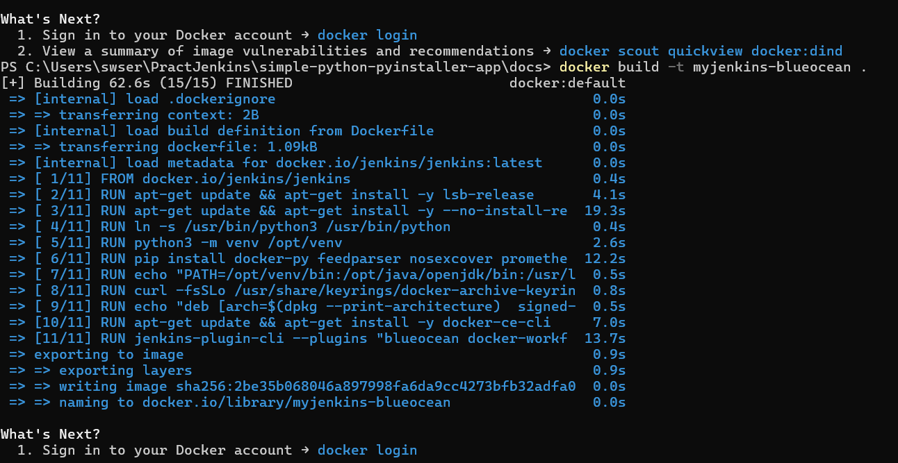

# PRÁCTICA JENKINS #
# ENUNCIADO #
1. Debéis realizar un despliegue de una aplicación Python mediante un pipeline de Jenkins
tal como se indica en el siguiente tutorial:
https://www.jenkins.io/doc/tutorials/build-a-python-app-with-pyinstaller/
La base del tutorial es la misma que la vista en clase para la aplicación de React. La
diferencia es que en este caso se trata de una aplicación Python
2. Usaremos Jenkins desplegado en un contenedor Docker
Debéis crear un fork del repositorio indicado en el tutorial
3. En el tutorial emplea un repositorio local del fork realizado, pero en vuestro caso
debéis acceder directamente al repositorio del fork

4. Debéis crear un pipeline en Jenkins que realice el despliegue de la aplicación en un
contenedor Docker
5. El despliegue de los dos contenedores Docker necesarios (Docker in Docker y
Jenkins) debe realizarse mediante Terraform
6. Para crear la imagen personalizada de Jenkins debéis usar un Dockerfile tal como
hemos visto en clase, esto no debe realizarse mediante Terraform
7. El despliegue desde el pipeline debe hacerse usando una rama llamada main

# PROCESO E INSTRUCCIONES PARA EL DESPLIEGUE
1. Primero se realiza un fork del repositorio proporcionado. Consecuentemente, se creará la rama main que contendrá nuestro directorio docs que contendrá los archivos de Terraform, Dockerfile y este README.
2. Se procede a la configuración del archivo Dockerfile para la creación de la imagen personalizada de Jenkins. Previamente hay que realizar un docker pull jenkins/jenkins y docker pull docker:dind para las respectivas imágenes que se usarán posteriormente.
# Fichero Dockerfile #
```
FROM jenkins/jenkins #La imagen base de jenkins
USER root #El usuario root para privilegios
RUN apt-get update && apt-get install -y lsb-release #Actualiza la lista de paquetes e instala el paquete lsb-release
RUN apt-get update && apt-get install -y --no-install-recommends \
binutils ca-certificates curl git python3 python3-venv python3-pip python3-setuptools python3-wheel python3-dev wget \
&& rm -rf /var/lib/apt/lists/* #Actualiza la lista de paquetes e instala los paquetes necesarios para la ejecución correcta de python
RUN ln -s /usr/bin/python3 /usr/bin/python #Establece que al escribir python también se incluye python3 para programas específicos
RUN python3 -m venv /opt/venv #Entorno virtual para el desarrollo de Python y sus dependencias
ENV PATH="/opt/venv/bin:$PATH" #Variable de entorno PATH para incluir el directorio del entorno virtual 
RUN pip install docker-py feedparser nosexcover prometheus_client pycobertura pylint pytest pytest-cov requests setuptools sphinx pyinstaller #Instalación de las dependencias de python
RUN echo "PATH=${PATH}" >> /etc/environment #Agrega la ruta actual al PATH global del sistema
RUN curl -fsSLo /usr/share/keyrings/docker-archive-keyring.asc \
	https://download.docker.com/linux/debian/gpg  #Descarga de la clave GPG
RUN echo "deb [arch=$(dpkg --print-architecture) \
	signed-by=/usr/share/keyrings/docker-archive-keyring.asc] \
	https://download.docker.com/linux/debian \
	$(lsb_release -cs) stable" > /etc/apt/sources.list.d/docker.list #Instalar el cliente de Docker desde el repositorio de Docker
RUN apt-get update && apt-get install -y docker-ce-cli #Actualiza los paquetes e instala el cliente de Docker
USER jenkins #Cambia al usuario Jenkins
RUN jenkins-plugin-cli --plugins "blueocean docker-workflow"  #Instalar los plugins necesarios
```

3. Una vez creado el Dockerfile ejecutar en la terminal:
```
docker build -t myjenkins-blueocean .
```



4. Una vez construida la imagen personalizada de Jenkins, se procede a la creación del archivo terraform dentro del directorio docs de la rama main.
# Fichero Terraform #
```
terraform {
  required_providers {
    docker = {
      source  = "kreuzwerker/docker"
      version = "~>3.0.1"
    }
  }
}

provider "docker" {}

resource "docker_image" "docker_dind" {
  name         = "docker:dind"
  keep_locally = false
}

resource "docker_image" "myjenkins-blueocean" {
  name         = "myjenkins-blueocean"
  keep_locally = false
}

resource "docker_volume" "my_volume" {
  name = "my_volume"
}

resource "docker_network" "jenkins" {
  name = "jenkins"
}

resource "docker_container" "docker_dind" {
  image      = docker_image.docker_dind.image_id
  name       = "jenkins-docker"
  privileged = true
  ports {
    internal = 2376
    external = 2376
  }
  volumes {
    volume_name    = docker_volume.my_volume.name
    container_path = "/certs/client"
  }
  networks_advanced {
    name = docker_network.jenkins.name
  }
}

resource "docker_container" "myjenkins-blueocean" {
  image      = "myjenkins-blueocean"
  name       = "jenkins-blueocean"
  privileged = true
  ports {
    internal = 8080
    external = 8080
  }
  ports {
    internal = 50000
    external = 50000
  }
  volumes {
    volume_name    = docker_volume.my_volume.name
    container_path = "/var/jenkins_home"
  }
  networks_advanced {
    name = docker_network.jenkins.name
  }
}
```